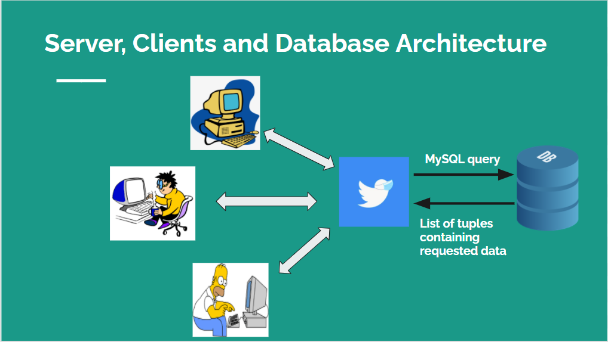
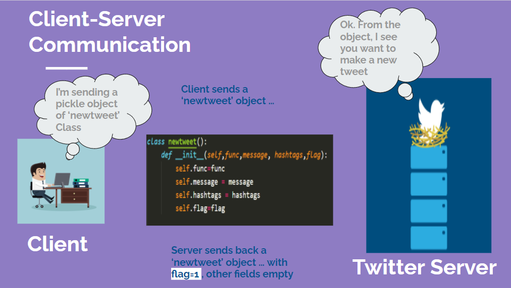

# Mini-Twitter
A basic and user friendly twitter in python3 and MySQL server database in the backend

---

## Requirements and Libraries

1. [MySQL](https://dev.mysql.com/downloads/installer/) must be installed
2. python3 libraies
    1. mysql.connector
    2. select
    3. pickle

## Usage

1. Run MySQL server as Administrator and run the following queries for database setup (NOTE: Use exact names as specified below) -
  - create database

    `$ create database Minitweet` 
  - change database

    `$ use Minitweet` 
    
  - create table Users

    `$ create table Users ( Username varchar(50) NOT NULL UNIQUE, Password varchar(50), Email varchar(50), Name varchar(50), Age int, Gender varchar(2), Status varchar(50), City varchar(50), Institute varchar(50));` 
    
  - create table Tweets

    `$ create table Tweets ( Username varchar(50), TweetID varchar(20), TweetMessage varchar(500), Hashtag1 varchar(30), Hashtag2 varchar(30), Hashtag3 varchar(30), Hashtag4 varchar(30), Hashtag5 varchar(30), Retweets int DEFAULT 0);` 

  - create table Hashtags

    `$ create table Hashtags (Tag varchar(30), Count int);` 

2. Open a terminal and run the server with following commmand and enter the port number when asked - 

    `$ python3 server.py`

3. Run multiple clients in different terminals with the following command - 

    `$ python3 client.py`

4. Run clients through GUI -

    `$ python3 client_gui.py`

---
## Architecture

  

---

## Communication

Exchange of data between server and clients in the form of objects of particular classes corresponding to functions. There exists a function for each functionality.

  

---

## Functionalities

1. Signup for a new account
2. Login into an existing account and see the latest tweets
3. Follow or unfollow a person and delete a follower
4. Post a new tweet with hashtags and every tweet gets a new Tweet ID
5. Retweet a tweet using its Tweet ID
6. Show trending hashtags
7. Search for tweets related to particular hashtags
8. Chat Room - enter the chat room to interact with other clients in the chat room

---

## Features

- Concurrent Server - server can handle multiple clients simultaneously. Server is made threaded using _thread library of python. Threads being light weight process improves performance and reduces time consumption in a single query.
- Use of Structured data - Data transfer is done in the form of objects (specifically pickle objects).
- For each functionality there exists a function and its corresponding class.
- Complete modular and commented code with ease of understanding

---